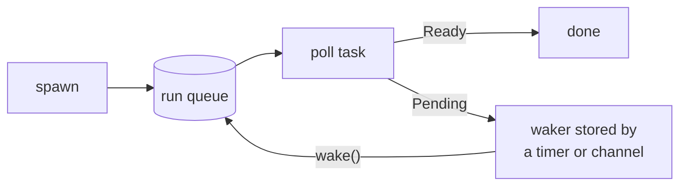

# mini-async-runtime

A small single-threaded async runtime for Rust, written from scratch using
only the standard library: no dependencies, no extra threads, no `unsafe`.

It has the core pieces of a runtime like tokio, an executor, wakers, timers and
a channel, in about 400 lines that you can read in one sitting.

## Example

```rust
use std::time::Duration;
use mini_async_runtime::{bounded_channel, run_blocking, sleep, spawn};

let sum = run_blocking(async {
    let (tx, mut rx) = bounded_channel(2);
    spawn(async move {
        for i in 1..=3 {
            sleep(Duration::from_millis(5)).await;
            tx.send(i).await.unwrap();
        }
    });

    let mut sum = 0;
    while let Some(i) = rx.recv().await {
        sum += i;
    }
    sum
});
assert_eq!(sum, 6);
```

## Running it

```bash
cargo test                  # unit tests + the example above as a doc test
cargo run --example demo    # all the features working together
```

The demo runs three workers that sleep for 10, 20 and 30 ms alongside a
producer and consumer sharing a channel. The sleeps overlap, so the whole thing
finishes in about 30 ms rather than 60:

```text
[38.48µs] main: starting
[5.16ms] producer: sent 0
[5.18ms] consumer: got 0
[10.14ms] worker 1: woke after 10ms
...
[30.15ms] worker 3: woke after 30ms
[30.18ms] main: workers returned sum = 600
```

## API

| Item | What it does |
|------|--------------|
| `run_blocking(future) -> T` | Runs a future to completion on the current thread and returns its output. |
| `spawn(future) -> JoinHandle<T>` | Starts a task that runs concurrently. Await the handle to get the task's result. |
| `sleep(duration)` | Suspends the current task for `duration` without blocking the thread. |
| `bounded_channel(capacity) -> (Sender<T>, Receiver<T>)` | Async multi-producer, single-consumer channel. Senders wait while it's full. |
| `yield_now()` | Lets other ready tasks run before the current one continues. |

## How it works



**Executor** (`src/executor.rs`). A task is a boxed future inside an `Arc`.
The run queue is a std `mpsc` channel of tasks, and a task's waker just pushes
the task back onto that queue. `run_blocking` loops: fire any due timers, poll
the next ready task, and when nothing is ready, block on the queue until a task
arrives or the next timer is due. An idle runtime uses no CPU.

**Timers** (`src/time.rs`). `sleep` puts its deadline and waker into a
min-heap and isn't polled again until the deadline passes. Timers are checked
on every pass of the loop, so a task that keeps yielding can't starve a
sleeping one.

**Channel** (`src/channel.rs`). A `VecDeque` behind a mutex. `recv` on an
empty channel stores the receiver's waker; `send` on a full one stores the
sender's. Each side wakes the other when it changes the buffer. Dropping the
last `Sender` ends the stream (`recv` returns `None`), and dropping the
`Receiver` makes pending sends return `Err(value)`.

**Shutdown.** When the main future finishes, `run_blocking` drops every task
that is still pending and clears the timer heap, so destructors run and nothing
carries over to the next call.

## Design decisions and limitations

- `run_blocking` returns as soon as the main future completes. Spawned tasks
  that haven't finished are dropped at that point, the same as tokio's
  current-thread runtime. Await a task's `JoinHandle` if you need it to finish.
- Futures must be `Send + 'static` because the runtime uses the standard
  `Wake` trait, which requires `Send + Sync`. Avoiding this would take a
  hand-written `RawWaker` and `unsafe`.
- A panic in any task propagates out of `run_blocking` instead of being
  contained to that task.
- `spawn` only works inside `run_blocking`, on the same thread, and
  `run_blocking` can't be nested (calling it from inside a task panics).
- When a slot frees up, the channel wakes every waiting sender instead of just
  one. That rules out lost wakeups simply, at the cost of extra wakeups when
  many senders are blocked at once.

This is a learning project. For real programs, use [tokio](https://tokio.rs)
or [smol](https://github.com/smol-rs/smol).

## Project layout

```text
src/lib.rs        public API and the crate-level example
src/executor.rs   run queue, wakers, run_blocking, spawn, JoinHandle, yield_now
src/time.rs       timer heap and sleep
src/channel.rs    bounded async MPSC channel
examples/demo.rs  end-to-end demo
```

## Tests

`cargo test` covers each feature (returning values, spawning, `JoinHandle`
results, sleeping, overlapping sleeps, ordered channel delivery, backpressure
and closing) plus regression tests for the subtle cases: timers firing while
other tasks stay busy, pending tasks being dropped on return, nested
`run_blocking`, and a blocked sender's wakeup getting lost.

## License

[MIT](LICENSE)
